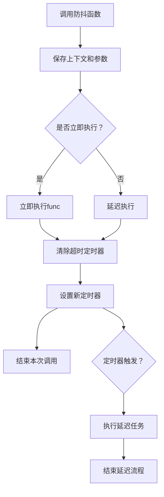

# JavaScript笔记

## 字符串

### == 和 === 问题

new 关键字使代码复杂化。也可能产生一些意想不到的结果：
当使用 == 相等运算符时，相等字符串是相等的：

```javascript
var x = "Bill";             
var y = new String("Bill");
// (x == y) 为 true，因为 x 和 y 的值相等
```

当使用 `===` 运算符时，相等字符串是不相等的，因为 `===` 运算符需要类型和值同时相等。

```javascript
var x = "Bill";             
var y = new String("Bill");

// (x === y) 为 false，因为 x 和 y 的类型不同（字符串与对象）
```

甚至更糟。对象无法比较：

``` javascript
var x = new String("Bill");             
var y = new String("Bill");
// (x == y) 为 false，因为 x 和 y 是不同的对象

var x = new String("Bill");             
var y = new String("Bill");
// (x === y) 为 false，因为 x 和 y 是不同的对象

```

## JS控制CSS样式失效问题

```HTML
    <style>
        canvas {
            width: 800px;
            height: 800px;
            border: 1px solid black;
            background-color: pink;
        }
    </style>
    <canvas id="draw"></canvas>
```
```JavaScript
    const canvas = document.querySelector('#draw');
            // console.log(canvas);
            console.log(canvas.style.width);
            console.log(canvas.style.height);

            canvas.width = window.innerWidth;
            canvas.height = window.innerHeight;

            console.log(canvas.width);
            console.log(canvas.height);
```


根据你的代码和问题，`console.log(canvas.style.width)` 打印不出 canvas 宽度的原因如下：
### 思考
好的，我现在需要解决用户的问题，用户在代码中使用`console.log(canvas.style.width)`打印不出canvas的宽度。首先，我需要仔细分析用户提供的代码和上下文。 首先看用户提供的HTML文件test.html。在CSS部分，canvas的样式被设置为width:800px和height:800px。然后在JavaScript中，用户尝试通过`canvas.style.width`来获取宽度，但输出为空。 用户的问题是，为什么`console.log(canvas.style.width)`打印不出宽度。我需要回忆一下HTML Canvas的属性和样式的关系。Canvas元素有两个相关的属性：一个是HTML属性width和height，另一个是CSS样式中的width和height。这两者是不同的。 HTML的canvas元素的width和height属性是实际的像素尺寸，决定了画布的坐标系统。而CSS样式中的width和height是控制元素在页面中的显示尺寸，可能改变元素的大小，但不会影响实际的像素比例。 在用户的代码中，他们先设置了CSS样式中的width和height为800px，这会影响canvas的显示大小。然后在JavaScript中，他们通过`canvas.width = window.innerWidth`和`canvas.height = window.innerHeight`修改了canvas的HTML属性，这会改变实际的像素区域，但不会影响CSS样式中的值。 用户使用`canvas.style.width`来获取的是CSS样式中的width值，而不是HTML属性的值。因此，当用户在JavaScript中修改了HTML属性的width后，CSS样式中的width并没有被自动更新，仍然保持原来的800px，或者如果用户没有显式设置的话可能为空。 但根据用户提供的代码，CSS样式中确实设置了width:800px，所以`canvas.style.width`应该返回"800px"。然而，用户提到打印不出来，可能是因为在代码中，用户可能在设置HTML属性之后，没有正确获取到CSS的样式值，或者存在其他问题。 另外，用户在代码中执行了`canvas.width = window.innerWidth`，这会改变HTML属性的width，但不会影响CSS的style.width。因此，如果用户想获取HTML属性的width，应该直接访问canvas.width，而不是canvas.style.width。 可能用户混淆了HTML属性和CSS样式。用户可能想获取的是HTML属性的宽度，但错误地使用了style.width。因此，正确的做法应该是： - 要获取HTML属性的宽度，使用canvas.width。 - 要获取CSS样式中的宽度，使用canvas.style.width，但要注意这可能返回空字符串，如果样式是通过CSS类或外部样式表设置的，而不是直接设置在元素的style属性上。 在用户的代码中，CSS样式是通过内部样式表设置的，而不是直接设置在canvas元素的style属性上，因此`canvas.style.width`可能返回空字符串，因为样式是来自外部样式表，而不是元素的内联style属性。 因此，用户的问题可能在于他们试图通过`canvas.style.width`来获取通过CSS样式表设置的宽度，而实际上需要使用window.getComputedStyle来获取计算后的样式。 总结问题原因： 1. 用户混淆了HTML属性和CSS样式属性。 2. 使用`canvas.style.width`只能获取元素内联样式中的width值，而用户的样式是通过内部样式表设置的，因此需要使用getComputedStyle。 解决方案： - 如果想获取HTML属性的宽度，使用canvas.width。 - 如果想获取CSS计算后的宽度，使用`window.getComputedStyle(canvas).width`。 现在需要将这些分析整理成用户容易理解的回答，并给出正确的代码示例。

---

### **核心问题：HTML 属性与 CSS 样式的区别**
1. **HTML 属性（`canvas.width`/`canvas.height`）**  
   - 定义 canvas 的**实际像素区域**（内部坐标系统的大小）。  
   - 通过 `canvas.width = 800` 设置。

2. **CSS 样式（`canvas.style.width`）**  
   - 控制 canvas 元素在页面中的**显示尺寸**，通过 CSS 样式表或内联样式设置。  
   - `canvas.style.width` 仅获取元素内联的 `style="width: ..."` 属性值，**不包括外部样式表或 `<style>` 标签中的样式**。

---

### **你的代码问题分析**
#### 1. **CSS 样式未设置为内联样式**
   ```css
   canvas {
     width: 800px;
     height: 800px;
     /* 其他样式... */
   }
   ```
   - **问题**：  
     这是通过 CSS 类或样式表设置的，**不会直接反映在 `canvas.style.width` 中**。  
     `canvas.style.width` 只读取元素本身的 `style` 属性（如 `<canvas style="width: 800px">`），而非外部样式。

#### 2. **JavaScript 修改了 HTML 属性**
   ```javascript
   canvas.width = window.innerWidth; // 修改 HTML 属性
   ```
   - 这会改变 canvas 的实际像素区域，但 **不会影响 CSS 样式**。

#### 3. **`console.log(canvas.style.width)` 的实际值**
   - 如果 CSS 样式是通过 `<style>` 标签或外部样式表设置的，`canvas.style.width` **返回空字符串**，因为样式未直接写在元素的 `style` 属性中。

---

### **解决方案**
#### 1. **获取 CSS 计算后的样式**
   使用 `window.getComputedStyle()` 获取元素最终的 CSS 样式：
   ```javascript
   console.log(getComputedStyle(canvas).width); // 输出 "800px"
   console.log(getComputedStyle(canvas).height); // 输出 "800px"
   ```

#### 2. **获取 HTML 属性的宽度**
   直接访问 `canvas.width` 和 `canvas.height`：
   ```javascript
   console.log(canvas.width); // 输出 window.innerWidth 的值
   console.log(canvas.height); // 输出 window.innerHeight 的值
   ```

#### 3. **修正代码示例**
   ```javascript
   ;(function () {
     const canvas = document.querySelector('#draw');
     const ctx = canvas.getContext("2d");

     // 获取 HTML 属性的宽度
     console.log('HTML 属性 width:', canvas.width); // 初始值为默认 300（未设置时）

     // 设置 HTML 属性的宽度和高度
     canvas.width = window.innerWidth;
     canvas.height = window.innerHeight;

     // 获取 CSS 计算后的样式
     console.log('CSS 样式 width:', getComputedStyle(canvas).width); // 输出 "800px"
     console.log('HTML 属性 width:', canvas.width); // 输出 window.innerWidth 的值

     // 其他代码...
   })();
   ```

---

### **关键点总结**
| **方法**                   | **获取的内容**                     | **适用场景**                   |
| -------------------------- | ---------------------------------- | ------------------------------ |
| `canvas.width`             | HTML 属性的像素区域宽度            | 绘制操作、坐标计算             |
| `canvas.style.width`       | 元素内联的 `style="width"` 值      | 直接修改元素的内联样式         |
| `getComputedStyle().width` | CSS 最终渲染后的宽度（含所有样式） | 获取元素在页面中的实际显示尺寸 |

---

### **完整修复后的代码**
```html
<!DOCTYPE html>
<html>
<head>
  <style>
    canvas {
      width: 800px;
      height: 800px;
      border: 1px solid black;
      background-color: pink;
    }
  </style>
</head>
<body>
  <canvas id="draw"></canvas>
  <script>
    ;(function () {
      const canvas = document.querySelector('#draw');
      const ctx = canvas.getContext("2d");

      // 获取 HTML 属性的初始值（默认 300×150）
      console.log('初始 HTML width:', canvas.width);
      console.log('初始 HTML height:', canvas.height);

      // 设置 HTML 属性的宽度和高度
      canvas.width = window.innerWidth;
      canvas.height = window.innerHeight;

      // 获取 CSS 计算后的样式（来自样式表）
      console.log('CSS 宽度:', getComputedStyle(canvas).width); // 输出 "800px"
      console.log('CSS 高度:', getComputedStyle(canvas).height); // 输出 "800px"

      // 获取 HTML 属性的新值
      console.log('修改后的 HTML width:', canvas.width); // 输出窗口宽度
      console.log('修改后的 HTML height:', canvas.height); // 输出窗口高度

      // 其他代码...
    })();
  </script>
</body>
</html>
```

---

### **最终结论**
- **`canvas.style.width` 无法获取 CSS 样式表设置的值**，需改用 `getComputedStyle()`。
- **HTML 属性（`canvas.width`）和 CSS 样式（`width`）是两个独立的概念**，需根据需求选择合适的获取方式。

[Js：DOM中的样式（包含行内样式、滚动区、可见区等）](https://blog.csdn.net/Y1914960928/article/details/145288336?spm=1001.2101.3001.6650.3&utm_medium=distribute.pc_relevant.none-task-blog-2%7Edefault%7EYuanLiJiHua%7EPosition-3-145288336-blog-140862685.235%5Ev43%5Epc_blog_bottom_relevance_base5&depth_1-utm_source=distribute.pc_relevant.none-task-blog-2%7Edefault%7EYuanLiJiHua%7EPosition-3-145288336-blog-140862685.235%5Ev43%5Epc_blog_bottom_relevance_base5&utm_relevant_index=4)

## for循环 let 声明前后影响性能问题
### 性能与ij是否被块包裹有关，ij全被包裹在块内 > ij其中一个变量被块包裹 > ij全暴露在块外
```javaScript
 // timing
    //test1 test2 都没用块包裹 test1 i j 暴露在外，test2 i j 被for块包裹了，i j 不暴露在外
    console.time('test1');
    let i = 0;
    let j = 0;
    for (i = 0; i < 100000000; i++) {
      j = i;
    }
    console.timeEnd('test1');//test1: 641.403076171875 ms

    console.time('test2');
    for (let i = 0; i < 100000000; i++) {
      let j = i;
    }
    console.timeEnd('test2');//test2: 168.1298828125 ms

    // test1使用块{}包裹 和 test2使用块{}包裹 耗时差不多
    {
      console.time('test1使用块{}包裹');
      let i = 0;
      let j = 0;
      for (i = 0; i < 100000000; i++) {
        j = i;
      }
      console.timeEnd('test1使用块{}包裹');// test1使用块{ } 包裹: 178.97412109375 ms
    }

    {
      console.time('test2使用块{}包裹');
      for (let i = 0; i < 100000000; i++) {
        let j = i;
      }
      console.timeEnd('test2使用块{}包裹');// test2使用块{ } 包裹: 188.85498046875 ms
    }

    // test3 test4 都未没用块包裹 test3 i1 暴露在外，test4 j2 暴露在外 耗时差不多
    console.time('test3');
    let i1 = 0;
    for (i1 = 0; i1 < 100000000; i1++) {
      let j1 = i1;
    }
    console.timeEnd('test3'); //test3: 368.987060546875 ms

    console.time('test4');
    let j2 = 0;
    for (let i2 = 0; i2 < 100000000; i2++) {
      j2 = i2;
    }
    console.timeEnd('test4'); //test4: 355.783203125 ms

    {
      console.time('test5');
      let i1 = 0;
      for (i1 = 0; i1 < 100000000; i1++) {
        let j1 = i1;
      }
      console.timeEnd('test5'); //test5: 187.072021484375 ms
    }

    {
      console.time('test6');
      let j2 = 0;
      for (let i2 = 0; i2 < 100000000; i2++) {
        j2 = i2;
      }
      console.timeEnd('test6'); //test6: 199.561767578125 ms
    }
```
### 思考
嗯，用户问的是为什么test1和test2的时间差异那么大。首先，我得看看他们的代码有什么不同。test1的循环里用了外层的变量i和j，而test2里用的是let声明的i。 首先想到的是变量作用域的问题。在test1中，i和j是用var或者全局声明的？不，这里用户用的是let，但test1中的i和j是定义在循环外部的。而test2的i是定义在for循环里的，所以每次循环i都是块级作用域的，可能性能更好？ 或者，可能是因为变量提升或者作用域链的不同导致的性能差异。比如，在test1中，每次循环都要访问外层的i和j，而test2中的i是局部变量，访问更快？ 另外，test1的j被赋值为i，可能每次循环都要进行赋值操作，而test2的j在循环内部声明，但同样赋值。不过，可能test2的变量i是块级作用域，引擎优化更好，比如避免变量提升带来的性能开销？ 或者，test1中的i和j是外层变量，每次循环修改它们的值可能导致更多的内存访问或变量查找时间，而test2的i是局部变量，作用域更小，引擎可以更高效地处理？ 另外，可能test1的循环因为变量i在外部定义，导致每次迭代都要重新查找变量，而test2的i是局部变量，可能被优化为寄存器变量，减少了查找时间？ 再想，test1的j是外部变量，每次赋值都要修改外层的变量，而test2的j是每次循环内部声明的，但同样赋值。不过test2的j可能每次循环都重新声明，但因为let是块级作用域，可能在循环内部更高效？ 或者，可能test1的循环因为i和j是外层变量，导致循环无法被某些优化，比如循环展开，而test2的变量是局部的，可以被更好地优化？ 或者，可能test2的代码更简洁，比如没有外层的变量，所以引擎可以更快地执行？ 另外，看代码中的注释，test1用了7.5秒，test2用了2.3秒，差异很大。这可能是因为test1中的i和j是外层变量，导致每次循环都要访问外层作用域，而test2的i是局部变量，访问更快？ 或者，test1的j被多次赋值，而test2的j可能没有被持续修改？不过test2的j每次循环都会重新声明吗？不，test2的j在循环内部声明，每次循环都会重新声明吗？不，因为for循环的let i是每次循环都创建新的i，但j是在循环体内声明的，比如每次循环都会重新声明j吗？ 比如，在test2的循环中，每次循环的let j = i;，这样j每次都是新的块级变量，可能每次循环都要分配新的变量，但可能因为是局部变量，性能更好？ 或者，可能test1的i和j是外层变量，每次循环修改它们的值会导致更多的内存写入操作，而test2的i是局部变量，可能被优化为寄存器变量，减少内存访问？ 另一个可能性是变量提升的问题。在test1中，i和j是用let声明在循环外部，所以它们的作用域是整个函数，而test2的i是块级作用域，可能让引擎更高效地处理？ 或者，可能test1的代码因为变量i在外部定义，导致循环无法被某些优化，比如循环不变量的优化？ 或者，test2的代码在循环内部使用let i，这使得i的作用域仅限于循环体内，而test1的i是外部变量，每次循环都要重新赋值，可能产生更多的内存操作？ 或者，test1的j是外层变量，每次循环都要修改它，而test2的j是每次循环内部声明的变量，可能被优化为临时变量，减少内存访问？ 总结可能的原因：test1的变量i和j是外层变量，每次循环都要访问和修改它们，导致更多的内存操作和作用域查找时间，而test2的变量i是局部变量，作用域更小，引擎可以更高效地处理，比如使用寄存器存储，减少访问时间。此外，test2的j在每次循环中声明为let，可能更高效，或者test2的代码结构让引擎能够进行更好的优化，比如循环展开，从而执行更快。
### **时间差异的主要原因**

#### **1. 变量作用域的差异**
- **`test1` 的代码**：
  ```javascript
  let i = 0;        // 外层变量（函数作用域）
  let j = 0;
  for (i = 0; i < 1e6; i++) {
    j = i;
  }
  ```
  - **问题**：`i` 和 `j` 是外层变量（函数作用域），每次循环都要 **重新赋值** 这两个变量。
  - **性能开销**：
    - 每次循环都要修改外层变量的值，涉及内存的频繁读写。
    - 外层变量的查找路径较长（需从函数作用域查找），导致性能下降。

- **`test2` 的代码**：
  ```javascript
  for (let i = 0; i < 1e6; i++) { // 块级作用域变量
    let j = i;                    // 每次循环声明新变量
  }
  ```
  - **优化点**：
    - `i` 是块级作用域变量（`let` 声明），每次循环迭代时，引擎可以将其优化为 **寄存器变量**（无需频繁内存访问）。
    - `j` 在循环体内声明为 `let`，每次迭代都会重新创建新变量，但因作用域较小，性能损耗较低。

---

#### **2. 引擎优化差异**
- **`test1` 的限制**：
  - 外层变量 `i` 和 `j` 的作用域较大（函数级），JavaScript 引擎难以进行 **循环展开**（Loop Unrolling）等优化。
  - 每次循环都要修改外层变量，导致 **副作用**（Side Effects），限制了引擎的优化空间。

- **`test2` 的优势**：
  - `i` 是块级作用域变量，且无外部依赖（仅在循环内部使用），引擎可安全地进行 **循环展开** 或 **内联优化**。
  - `j` 的声明和赋值在循环体内，属于 **无副作用** 的操作，引擎可进一步优化。

---

#### **3. 具体性能对比**
| **指标**       | `test1`（7.58ms）      | `test2`（2.35ms）    |
| -------------- | ---------------------- | -------------------- |
| 变量作用域     | 函数级（全局作用域）   | 块级（局部作用域）   |
| 引擎优化空间   | 受限（存在副作用）     | 广阔（无副作用）     |
| 内存访问频率   | 高（频繁修改外层变量） | 低（寄存器或栈优化） |
| 循环展开可能性 | 低                     | 高                   |

---

### **结论**
`test2` 的时间更短，**主要原因**是：
1. **块级作用域变量**（`let i`）使引擎能够高效优化循环。
2. **无副作用**的变量操作（`let j = i`）允许更激进的优化策略。
3. **寄存器/栈优化**减少了内存读写开销。

---

### **优化建议**
若需提升类似代码的性能，建议：
```javascript
// 使用块级作用域变量（let/const）
for (let i = 0; i < N; i++) {
  const j = i; // 或直接使用 i 而不额外声明 j
  // ...其他操作
}
```

## 闭包函数 箭头函数 this 指向问题
## 防抖和节流
### 防抖

## 表单form submit e.target和e.currentTarget的相同问题
```html
    <form class="add-items">
      <input type="text" name="item" placeholder="Item Name" required>
      <input type="submit" value="+ Add Item">
    </form>
```
```javascript
  function addItem(e) {
    // 阻止表单的默认提交行为
    e.preventDefault();
    // 获取当前的输入内容
    console.log(e.target, e.currentTarget);//都是form表单
    console.log(e.target === e.currentTarget);//true
  }
  addItems.addEventListener('submit', addItem)
```
在你的代码中，`e.target`和`e.currentTarget`都指向表单元素的原因如下：

---

### **关键原因**
1. **事件类型是`submit`**  
   你监听的是表单的`submit`事件，而`submit`事件的**目标始终是表单本身**，而非触发提交的`<input type="submit">`按钮。  
   - 当用户点击提交按钮时，浏览器会自动触发表单的`submit`事件，此时事件的目标（`e.target`）是表单，而非按钮。

2. **`e.target`的行为**  
   - `submit`事件的目标是**触发事件的元素**（即表单），而不是直接被点击的按钮。  
   - 如果监听的是按钮的`click`事件，则`e.target`会是按钮，但这里监听的是表单的`submit`事件。

3. **`e.currentTarget`的固定性**  
   - 事件监听器绑定在表单（`addItems`）上，因此`e.currentTarget`始终是表单。

---

### **代码验证**
在你的代码中：
```javascript
// 监听的是表单的submit事件
addItems.addEventListener('submit', addItem); 

function addItem(e) {
  console.log(e.target === e.currentTarget); // 输出 true（两者都是表单）
}
```
- **输出结果**：  
  `e.target`和`e.currentTarget`均指向表单元素，因为`submit`事件的触发目标就是表单。

---

### **对比场景**
如果监听的是按钮的`click`事件：
```javascript
// 监听按钮的click事件
const submitBtn = document.querySelector('.add-items [type="submit"]');
submitBtn.addEventListener('click', handleClick);

function handleClick(e) {
  console.log(e.target); // 输出按钮元素（<input type="submit">）
  console.log(e.currentTarget); // 输出按钮元素（因为监听器绑定在按钮上）
}
```
此时`e.target`和`e.currentTarget`均指向按钮。

---

### **总结**
- **`submit`事件特性**：其事件目标始终是表单，而非触发提交的按钮。
- **事件类型选择**：  
  - 若需操作按钮，应监听按钮的`click`事件。  
  - 若需处理表单提交逻辑，监听表单的`submit`事件是正确的做法（此时需通过表单元素获取输入值）。

---

### **如何获取输入值？**
在你的代码中，应通过表单元素（`e.currentTarget`）获取输入字段：
```javascript
function addItem(e) {
  e.preventDefault();
  const inputElement = e.currentTarget.querySelector('[name="item"]');
  const text = inputElement.value; // 正确获取输入内容
  console.log(text);
}
```
## e.currentTarget和e.target的区别
```html
    <div id="a">
      <div id="b">
        <div id="c">
          <div id="d">哈哈哈哈哈</div>
        </div>
      </div>
    </div>
```
```javascript
const a = document.getElementById('a')
const b = document.getElementById('b')
const c = document.getElementById('c')
const d = document.getElementById('d')
a.addEventListener('click', (e) => {
  const {
    target,
    currentTarget
  } = e
  console.log(`target是${target.id}`)
  console.log(`currentTarget是${currentTarget.id}`)
})
b.addEventListener('click', (e) => {
  const {
    target,
    currentTarget
  } = e
  console.log(`target是${target.id}`)
  console.log(`currentTarget是${currentTarget.id}`)
})
c.addEventListener('click', (e) => {
  const {
    target,
    currentTarget
  } = e
  console.log(`target是${target.id}`)
  console.log(`currentTarget是${currentTarget.id}`)
})
d.addEventListener('click', (e) => {
  const {
    target,
    currentTarget
  } = e
  console.log(`target是${target.id}`)
  console.log(`currentTarget是${currentTarget.id}`)
})
```
```javascript
target是d currentTarget是d
target是d currentTarget是c
target是d currentTarget是b
target是d currentTarget是a
```

## map Array.prototype.map的用法
是的，在 `Array.prototype.map` 方法的回调函数中，**第二个参数是当前项的索引（`index`）**。以下是具体说明：

---

### **`map` 方法的参数定义**
`map` 回调函数的参数顺序为：
```javascript
(arrayItem, index, array) => {}
```
- **第一个参数**：当前处理的元素（如代码中的 `plate`）。
- **第二个参数**：当前元素的 **索引**（从 `0` 开始递增）。
- **第三个参数**：原数组（通常不常用，可忽略）。

---

### **你的代码中的 `i` 是索引**
在你的代码片段中：
```javascript
plates.map((plate, i) => { // i 是当前项的索引
  return `
    <li>
      <input type="checkbox" data-index=${i} id="item${i}" ... />
      ...
    </li>
  `;
});
```
- **`i` 的作用**：
  1. **生成唯一标识**：通过 `id="item${i}"` 为每个复选框创建唯一 `id`（如 `item0`、`item1`）。
  2. **记录数据位置**：通过 `data-index=${i}` 将数组索引存储为自定义属性，方便后续操作（如点击复选框时定位到对应的数据项）。

---

### **为什么需要索引？**
- **关联数据和 DOM**：  
  当用户点击复选框时，通过 `data-index` 可以直接获取该元素在 `items` 数组中的位置，从而更新对应项的 `done` 状态：
  ```javascript
  function toggleDone(e) {
    const index = e.target.dataset.index; // 通过索引找到数据项
    items[index].done = !items[index].done;
    // ...
  }
  ```

- **确保唯一性**：  
  每个复选框的 `id` 必须唯一，`i` 确保了这一点（如 `item0`、`item1` 等）。

---

### **总结**
- **`map` 的第二个参数是索引**，在你的代码中正确使用了它。
- **用途**：生成唯一标识、关联数据与 DOM 元素、定位数组中的具体项。

如果还有其他疑问，可以进一步探讨！ 😊

## 箭头函数指向问题 在事件处理函数中，你使用了箭头函数，导致 this 不再指向事件的目标元素，而是继承外层函数的 this（全局对象 window）

## reduce 详解
```javascript
//reduce详解
;(function name(params) {

    const getMax = (a, b) => {
        console.log(a, b)
        return Math.max(a, b)
    }
    // 从索引 0 开始为数组中的每个元素调用回调函数
    [1, 100].reduce(getMax, 50); // 100
    console.log('--------------------------');
    [50].reduce(getMax, 10); // 50
    console.log('--------------------------');
    // 仅为索引 1 处的元素调用回调函数
    [1, 100].reduce(getMax); // 100
    console.log('--------------------------');
    // 不调用回调函数
    [50].reduce(getMax); // 50
    console.log('--------------------------');
    [].reduce(getMax, 1); // 1
    console.log('--------------------------');
    // [].reduce(getMax); // TypeError

    //求对象数组中值的总和
    // 为了对包含在对象数组中的值进行求和，必须提供一个 initialValue，以便每个项都通过回调函数处理。
    const objects = [{ x: 1 }, { x: 2 }, { x: 3 }];
    const sum = objects.reduce(
        (accumulator, currentValue) => accumulator + currentValue.x,
        0,
    );
    console.log(sum); // 6

    // 展平嵌套数组
    const flattened = [
        [0, 1],
        [2, 3],
        [4, 5],
    ].reduce((accumulator, currentValue) => accumulator.concat(currentValue), []);
    // flattened 的值是 [0, 1, 2, 3, 4, 5]

    // 统计对象中值的出现次数
    const names = ["Alice", "Bob", "Tiff", "Bruce", "Alice"];

    const countedNames = names.reduce((allNames, name) => {
        const currCount = allNames[name] ?? 0;
        return {
            ...allNames,
            [name]: currCount + 1,
        };
    }, {});
    // countedNames 的值是：
    // { 'Alice': 2, 'Bob': 1, 'Tiff': 1, 'Bruce': 1 }

})()

//按属性( )对对象进行分组
const people = [
        { name: "Alice", age: 21 },
        { name: "Max", age: 20 },
        { name: "Jane", age: 20 },
    ];

    function groupBy(objectArray, property) {
        return objectArray.reduce((acc, obj) => {
            const key = obj[property];
            acc[key] = acc[key] ?? [];
            acc[key].push(obj)
            return acc
        }, {});
    }

    const groupedPeople = groupBy(people, "age");
    console.table(groupedPeople);
    // {
    //   20: [
    //     { name: 'Max', age: 20 },
    //     { name: 'Jane', age: 20 }
    //   ],
    //   21: [{ name: 'Alice', age: 21 }]
    // }
```
## && || ?? 运算符的运用
在 JavaScript 中，`&&`、`||` 和 `??` 是三个逻辑运算符，它们的**运用场景和行为**有显著区别。以下是它们的典型应用场景和对比：

---

### **1. `&&`（逻辑与运算符）**
#### **作用**  
- **返回第一个假值（`false`、`0`、`null`、`undefined`、`NaN`、空字符串 `''`）或最后一个真值**。  
- **短路特性**：如果左侧为假值，直接返回左侧；否则返回右侧。

#### **典型场景**
#### (1) **条件判断与短路求值**  
```javascript
if (user && user.name) { // 如果 user 不存在，直接短路，不执行 user.name
  console.log(user.name);
}
```

#### (2) **函数调用的条件执行**  
```javascript
const result = validateInput() && processInput(); 
// 如果 validateInput() 返回 false，则不执行 processInput()
```

#### (3) **简洁赋值**  
```javascript
const value = getOption() && getOption().value; // 如果 getOption() 返回 null/undefined，直接赋值为它，否则取其 value 属性
```

---

### **2. `||`（逻辑或运算符）**
#### **作用**  
- **返回第一个真值或最后一个假值**。  
- **短路特性**：如果左侧为真值，直接返回左侧；否则返回右侧。

#### **典型场景**
#### (1) **提供默认值**  
```javascript
const name = user.name || 'Guest'; // 如果 user.name 为假值（如空字符串、null），使用 'Guest'
```

#### (2) **参数默认值**  
```javascript
function greet(name = 'World') {
  return `Hello ${name}`;
}
greet(); // "Hello World"
```

#### (3) **备选值选择**  
```javascript
const config = window.config || {}; // 如果 window.config 不存在，使用空对象
```

---

### **3. `??`（空值合并运算符，ES2020+）**
#### **作用**  
- **仅在左侧为 `null` 或 `undefined` 时，返回右侧值**。  
- 其他假值（如 `0`、`''`、`false`）会被保留，不会触发默认值。

#### **典型场景**
#### (1) **安全的默认值赋值**  
```javascript
const count = data.count ?? 0; // 如果 data.count 是 0，保留 0；如果是 null/undefined，使用 0
const name = user.name ?? 'Anonymous'; // 如果 user.name 是空字符串，保留空字符串
```

#### (2) **避免覆盖合法假值**  
```javascript
// 错误用法（||）：
const price = product.price || 100; // 如果 product.price 是 0，会错误地使用 100
// 正确用法（??）：
const price = product.price ?? 100; // 只有当 product.price 是 null/undefined 时，才使用 100
```

#### (3) **处理 API 返回的可能缺失值**  
```javascript
const userId = response.data?.userId ?? 'default'; // 如果 response.data.userId 不存在，使用 'default'
```

---

### **关键区别对比**
| 运算符 | 返回值逻辑           | 触发默认值的条件             | 典型用途                       |
| ------ | -------------------- | ---------------------------- | ------------------------------ |
| `&&`   | 短路返回最后一个真值 | -                            | 条件执行、链式调用             |
| `      |                      | `                            | 短路返回第一个真值             | 左侧为假值（包括 `0`、`''`、`false` 等） | 提供默认值（可能覆盖合法假值） |
| `??`   | 短路返回右侧值       | 左侧为 `null` 或 `undefined` | 安全默认值赋值（仅针对缺失值） |

---

### **常见错误与注意事项**
1. **`||` 的陷阱**：  
   当需要保留 `0`、空字符串等合法值时，避免使用 `||`，改用 `??`。  
   ```javascript
   const count = input || 0; // 如果 input 是 0，会错误地使用 0（但可能 input 就是 0）
   const count = input ?? 0; // 如果 input 是 null/undefined，使用 0；否则保留原值
   ```

2. **`&&` 的返回值**：  
   `&&` 返回的是最后一个表达式的结果，而非布尔值。  
   ```javascript
   const value = condition && 'result'; // 如果 condition 为真，返回 'result'；否则返回 condition 的值
   ```

3. **优先级问题**：  
   `&&` 的优先级高于 `||`，需注意括号的使用：  
   ```javascript
   a && b || c // 等价于 (a && b) || c
   ```

---

### **总结**
| 场景                                      | 推荐运算符 |
| ----------------------------------------- | ---------- |
| **条件执行或链式调用**                    | `&&`       |
| **提供默认值（包含所有假值）**            | `          |  | ` |
| **安全默认值（仅针对 `null/undefined`）** | `??`       |

合理使用这些运算符可以显著简化代码逻辑，但需注意它们的行为差异以避免意外结果。


