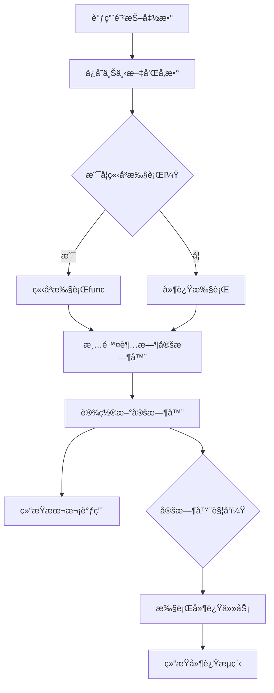

# JavaScript笔记

## 字符串

### == 和 === 问题

new 关键字使代ç å¤æ‚化。也å¯èƒ½äº§ç”Ÿä¸€äº›æ„想ä¸åˆ°çš„结æœï¼š
当使用 == 相等è¿ç®—符时，相等字符串是相等的：

```javascript
var x = "Bill";             
var y = new String("Bill");
// (x == y) 为 true，因为 x 和 y 的值相等
```

当使用 `===` è¿ç®—符时，相等字符串是ä¸ç›¸ç­‰çš„，因为 `===` è¿ç®—符需è¦ç±»å‹å’Œå€¼åŒæ—¶ç›¸ç­‰ã€‚

```javascript
var x = "Bill";             
var y = new String("Bill");

// (x === y) 为 false，因为 x å’Œ y çš„ç±»å‹ä¸åŒï¼ˆå­—符串ä¸å¯¹è±¡ï¼‰
```

甚至更糟。对象无法比较：

``` javascript
var x = new String("Bill");             
var y = new String("Bill");
// (x == y) 为 false，因为 x å’Œ y 是ä¸åŒçš„对象

var x = new String("Bill");             
var y = new String("Bill");
// (x === y) 为 false，因为 x å’Œ y 是ä¸åŒçš„对象

```

## JSæ§åˆ¶CSSæ ·å¼å¤±æ•ˆé—®é¢˜

```HTML
    <style>
        canvas {
            width: 800px;
            height: 800px;
            border: 1px solid black;
            background-color: pink;
        }
    </style>
    <canvas id="draw"></canvas>
```
```JavaScript
    const canvas = document.querySelector('#draw');
            // console.log(canvas);
            console.log(canvas.style.width);
            console.log(canvas.style.height);

            canvas.width = window.innerWidth;
            canvas.height = window.innerHeight;

            console.log(canvas.width);
            console.log(canvas.height);
```


æ ¹æ®ä½ çš„代ç å’Œé—®é¢˜ï¼Œ`console.log(canvas.style.width)` 打å°ä¸å‡º canvas 宽度的åŸå› å¦‚下：
### æ€è€ƒ
好的，我ç°åœ¨éœ€è¦è§£å†³ç”¨æˆ·çš„问题，用户在代ç ä¸­ä½¿ç”¨`console.log(canvas.style.width)`打å°ä¸å‡ºcanvas的宽度。首先，我需è¦ä»”细分æ用户æ供的代ç å’Œä¸Šä¸‹æ–‡ã€‚ 首先看用户æ供的HTML文件test.html。在CSS部分，canvasçš„æ ·å¼è¢«è®¾ç½®ä¸ºwidth:800pxå’Œheight:800px。然å在JavaScript中，用户å°è¯•é€šè¿‡`canvas.style.width`æ¥è·å–宽度，但输出为空。 用户的问题是，为什么`console.log(canvas.style.width)`打å°ä¸å‡ºå®½åº¦ã€‚我需è¦å›å¿†ä¸€ä¸‹HTML Canvasçš„å±æ€§å’Œæ ·å¼çš„关系。Canvas元素有两个相关的å±æ€§ï¼šä¸€ä¸ªæ˜¯HTMLå±æ€§widthå’Œheight，å¦ä¸€ä¸ªæ˜¯CSSæ ·å¼ä¸­çš„widthå’Œheight。这两者是ä¸åŒçš„。 HTMLçš„canvas元素的widthå’Œheightå±æ€§æ˜¯å®é™…çš„åƒç´ å°ºå¯¸ï¼Œå†³å®šäº†ç”»å¸ƒçš„å标系统。而CSSæ ·å¼ä¸­çš„widthå’Œheight是æ§åˆ¶å…ƒç´ åœ¨é¡µé¢ä¸­çš„显示尺寸，å¯èƒ½æ”¹å˜å…ƒç´ çš„大å°ï¼Œä½†ä¸ä¼šå½±å“å®é™…çš„åƒç´ æ¯”例。 在用户的代ç ä¸­ï¼Œä»–们先设置了CSSæ ·å¼ä¸­çš„widthå’Œheight为800px，这会影å“canvas的显示大å°ã€‚然å在JavaScript中，他们通过`canvas.width = window.innerWidth`å’Œ`canvas.height = window.innerHeight`修改了canvasçš„HTMLå±æ€§ï¼Œè¿™ä¼šæ”¹å˜å®é™…çš„åƒç´ åŒºåŸŸï¼Œä½†ä¸ä¼šå½±å“CSSæ ·å¼ä¸­çš„值。 用户使用`canvas.style.width`æ¥è·å–的是CSSæ ·å¼ä¸­çš„width值，而ä¸æ˜¯HTMLå±æ€§çš„值。因此，当用户在JavaScript中修改了HTMLå±æ€§çš„widthå，CSSæ ·å¼ä¸­çš„width并没有被自动更新，ä»ç„¶ä¿æŒåŸæ¥çš„800px，或者如æœç”¨æˆ·æ²¡æœ‰æ˜¾å¼è®¾ç½®çš„è¯å¯èƒ½ä¸ºç©ºã€‚ 但根æ®ç”¨æˆ·æ供的代ç ï¼ŒCSSæ ·å¼ä¸­ç¡®å®è®¾ç½®äº†width:800px，所以`canvas.style.width`应该返å›"800px"。然而，用户æ到打å°ä¸å‡ºæ¥ï¼Œå¯èƒ½æ˜¯å› ä¸ºåœ¨ä»£ç ä¸­ï¼Œç”¨æˆ·å¯èƒ½åœ¨è®¾ç½®HTMLå±æ€§ä¹‹å，没有正确è·å–到CSSçš„æ ·å¼å€¼ï¼Œæˆ–者存在其他问题。 å¦å¤–，用户在代ç ä¸­æ‰§è¡Œäº†`canvas.width = window.innerWidth`，这会改å˜HTMLå±æ€§çš„width，但ä¸ä¼šå½±å“CSSçš„style.width。因此，如æœç”¨æˆ·æƒ³è·å–HTMLå±æ€§çš„width，应该直æ¥è®¿é—®canvas.width，而ä¸æ˜¯canvas.style.width。 å¯èƒ½ç”¨æˆ·æ··æ·†äº†HTMLå±æ€§å’ŒCSSæ ·å¼ã€‚用户å¯èƒ½æƒ³è·å–的是HTMLå±æ€§çš„宽度，但错误地使用了style.width。因此，正确的åšæ³•åº”该是： - è¦è·å–HTMLå±æ€§çš„宽度，使用canvas.width。 - è¦è·å–CSSæ ·å¼ä¸­çš„宽度，使用canvas.style.width，但è¦æ³¨æ„è¿™å¯èƒ½è¿”å›ç©ºå­—符串，如æœæ ·å¼æ˜¯é€šè¿‡CSS类或外部样å¼è¡¨è®¾ç½®çš„，而ä¸æ˜¯ç›´æ¥è®¾ç½®åœ¨å…ƒç´ çš„styleå±æ€§ä¸Šã€‚ 在用户的代ç ä¸­ï¼ŒCSSæ ·å¼æ˜¯é€šè¿‡å†…部样å¼è¡¨è®¾ç½®çš„，而ä¸æ˜¯ç›´æ¥è®¾ç½®åœ¨canvas元素的styleå±æ€§ä¸Šï¼Œå› æ­¤`canvas.style.width`å¯èƒ½è¿”å›ç©ºå­—符串，因为样å¼æ˜¯æ¥è‡ªå¤–部样å¼è¡¨ï¼Œè€Œä¸æ˜¯å…ƒç´ çš„内è”styleå±æ€§ã€‚ 因此，用户的问题å¯èƒ½åœ¨äºä»–们试图通过`canvas.style.width`æ¥è·å–通过CSSæ ·å¼è¡¨è®¾ç½®çš„宽度，而å®é™…上需è¦ä½¿ç”¨window.getComputedStyleæ¥è·å–计算åçš„æ ·å¼ã€‚ 总结问题åŸå› ï¼š 1. 用户混淆了HTMLå±æ€§å’ŒCSSæ ·å¼å±æ€§ã€‚ 2. 使用`canvas.style.width`åªèƒ½è·å–元素内è”æ ·å¼ä¸­çš„width值，而用户的样å¼æ˜¯é€šè¿‡å†…部样å¼è¡¨è®¾ç½®çš„，因此需è¦ä½¿ç”¨getComputedStyle。 解决方案： - 如æœæƒ³è·å–HTMLå±æ€§çš„宽度，使用canvas.width。 - 如æœæƒ³è·å–CSS计算å的宽度，使用`window.getComputedStyle(canvas).width`。 ç°åœ¨éœ€è¦å°†è¿™äº›åˆ†ææ•´ç†æˆç”¨æˆ·å®¹æ˜“ç†è§£çš„å›ç­”，并给出正确的代ç ç¤ºä¾‹ã€‚

---

### **核心问题：HTML å±æ€§ä¸ CSS æ ·å¼çš„区别**
1. **HTML å±æ€§ï¼ˆ`canvas.width`/`canvas.height`）**  
   - 定义 canvas çš„**å®é™…åƒç´ åŒºåŸŸ**（内部å标系统的大å°ï¼‰ã€‚  
   - 通过 `canvas.width = 800` 设置。

2. **CSS æ ·å¼ï¼ˆ`canvas.style.width`）**  
   - æ§åˆ¶ canvas 元素在页é¢ä¸­çš„**显示尺寸**，通过 CSS æ ·å¼è¡¨æˆ–内è”æ ·å¼è®¾ç½®ã€‚  
   - `canvas.style.width` ä»…è·å–元素内è”çš„ `style="width: ..."` å±æ€§å€¼ï¼Œ**ä¸åŒ…括外部样å¼è¡¨æˆ– `<style>` 标签中的样å¼**。

---

### **你的代ç é—®é¢˜åˆ†æ**
#### 1. **CSS æ ·å¼æœªè®¾ç½®ä¸ºå†…è”æ ·å¼**
   ```css
   canvas {
     width: 800px;
     height: 800px;
     /* 其他样å¼... */
   }
   ```
   - **问题**：  
     这是通过 CSS 类或样å¼è¡¨è®¾ç½®çš„，**ä¸ä¼šç›´æ¥å映在 `canvas.style.width` 中**。  
     `canvas.style.width` åªè¯»å–元素本身的 `style` å±æ€§ï¼ˆå¦‚ `<canvas style="width: 800px">`），而é外部样å¼ã€‚

#### 2. **JavaScript 修改了 HTML å±æ€§**
   ```javascript
   canvas.width = window.innerWidth; // 修改 HTML å±æ€§
   ```
   - è¿™ä¼šæ”¹å˜ canvas çš„å®é™…åƒç´ åŒºåŸŸï¼Œä½† **ä¸ä¼šå½±å“ CSS æ ·å¼**。

#### 3. **`console.log(canvas.style.width)` çš„å®é™…值**
   - å¦‚æœ CSS æ ·å¼æ˜¯é€šè¿‡ `<style>` 标签或外部样å¼è¡¨è®¾ç½®çš„，`canvas.style.width` **è¿”å›ç©ºå­—符串**，因为样å¼æœªç›´æ¥å†™åœ¨å…ƒç´ çš„ `style` å±æ€§ä¸­ã€‚

---

### **解决方案**
#### 1. **è·å– CSS 计算åçš„æ ·å¼**
   使用 `window.getComputedStyle()` è·å–元素最终的 CSS æ ·å¼ï¼š
   ```javascript
   console.log(getComputedStyle(canvas).width); // 输出 "800px"
   console.log(getComputedStyle(canvas).height); // 输出 "800px"
   ```

#### 2. **è·å– HTML å±æ€§çš„宽度**
   ç›´æ¥è®¿é—® `canvas.width` å’Œ `canvas.height`：
   ```javascript
   console.log(canvas.width); // 输出 window.innerWidth 的值
   console.log(canvas.height); // 输出 window.innerHeight 的值
   ```

#### 3. **修正代ç ç¤ºä¾‹**
   ```javascript
   ;(function () {
     const canvas = document.querySelector('#draw');
     const ctx = canvas.getContext("2d");

     // è·å– HTML å±æ€§çš„宽度
     console.log('HTML å±æ€§ width:', canvas.width); // åˆå§‹å€¼ä¸ºé»˜è®¤ 300（未设置时）

     // 设置 HTML å±æ€§çš„宽度和高度
     canvas.width = window.innerWidth;
     canvas.height = window.innerHeight;

     // è·å– CSS 计算åçš„æ ·å¼
     console.log('CSS æ ·å¼ width:', getComputedStyle(canvas).width); // 输出 "800px"
     console.log('HTML å±æ€§ width:', canvas.width); // 输出 window.innerWidth 的值

     // 其他代ç ...
   })();
   ```

---

### **关键点总结**
| **方法**                   | **è·å–的内容**                     | **适用场景**                   |
| -------------------------- | ---------------------------------- | ------------------------------ |
| `canvas.width`             | HTML å±æ€§çš„åƒç´ åŒºåŸŸå®½åº¦            | 绘制æ“作ã€å标计算             |
| `canvas.style.width`       | 元素内è”çš„ `style="width"` 值      | ç›´æ¥ä¿®æ”¹å…ƒç´ çš„内è”æ ·å¼         |
| `getComputedStyle().width` | CSS 最终渲染å的宽度（å«æ‰€æœ‰æ ·å¼ï¼‰ | è·å–元素在页é¢ä¸­çš„å®é™…显示尺寸 |

---

### **完整修å¤å的代ç **
```html
<!DOCTYPE html>
<html>
<head>
  <style>
    canvas {
      width: 800px;
      height: 800px;
      border: 1px solid black;
      background-color: pink;
    }
  </style>
</head>
<body>
  <canvas id="draw"></canvas>
  <script>
    ;(function () {
      const canvas = document.querySelector('#draw');
      const ctx = canvas.getContext("2d");

      // è·å– HTML å±æ€§çš„åˆå§‹å€¼ï¼ˆé»˜è®¤ 300×150）
      console.log('åˆå§‹ HTML width:', canvas.width);
      console.log('åˆå§‹ HTML height:', canvas.height);

      // 设置 HTML å±æ€§çš„宽度和高度
      canvas.width = window.innerWidth;
      canvas.height = window.innerHeight;

      // è·å– CSS 计算åçš„æ ·å¼ï¼ˆæ¥è‡ªæ ·å¼è¡¨ï¼‰
      console.log('CSS 宽度:', getComputedStyle(canvas).width); // 输出 "800px"
      console.log('CSS 高度:', getComputedStyle(canvas).height); // 输出 "800px"

      // è·å– HTML å±æ€§çš„新值
      console.log('修改åçš„ HTML width:', canvas.width); // 输出窗å£å®½åº¦
      console.log('修改åçš„ HTML height:', canvas.height); // 输出窗å£é«˜åº¦

      // 其他代ç ...
    })();
  </script>
</body>
</html>
```

---

### **最终结论**
- **`canvas.style.width` 无法è·å– CSS æ ·å¼è¡¨è®¾ç½®çš„值**，需改用 `getComputedStyle()`。
- **HTML å±æ€§ï¼ˆ`canvas.width`）和 CSS æ ·å¼ï¼ˆ`width`）是两个独立的概念**，需根æ®éœ€æ±‚选择åˆé€‚çš„è·å–æ–¹å¼ã€‚

[Js：DOM中的样å¼ï¼ˆåŒ…å«è¡Œå†…æ ·å¼ã€æ»šåŠ¨åŒºã€å¯è§åŒºç­‰ï¼‰](https://blog.csdn.net/Y1914960928/article/details/145288336?spm=1001.2101.3001.6650.3&utm_medium=distribute.pc_relevant.none-task-blog-2%7Edefault%7EYuanLiJiHua%7EPosition-3-145288336-blog-140862685.235%5Ev43%5Epc_blog_bottom_relevance_base5&depth_1-utm_source=distribute.pc_relevant.none-task-blog-2%7Edefault%7EYuanLiJiHua%7EPosition-3-145288336-blog-140862685.235%5Ev43%5Epc_blog_bottom_relevance_base5&utm_relevant_index=4)

## forå¾ªç¯ let 声æ˜å‰åå½±å“性能问题
### 性能ä¸ij是å¦è¢«å—包裹有关，ij全被包裹在å—内 > ij其中一个å˜é‡è¢«å—包裹 > ij全暴露在å—外
```javaScript
 // timing
    //test1 test2 都没用å—包裹 test1 i j 暴露在外，test2 i j 被forå—包裹了，i j ä¸æš´éœ²åœ¨å¤–
    console.time('test1');
    let i = 0;
    let j = 0;
    for (i = 0; i < 100000000; i++) {
      j = i;
    }
    console.timeEnd('test1');//test1: 641.403076171875 ms

    console.time('test2');
    for (let i = 0; i < 100000000; i++) {
      let j = i;
    }
    console.timeEnd('test2');//test2: 168.1298828125 ms

    // test1使用å—{}包裹 å’Œ test2使用å—{}包裹 耗时差ä¸å¤š
    {
      console.time('test1使用å—{}包裹');
      let i = 0;
      let j = 0;
      for (i = 0; i < 100000000; i++) {
        j = i;
      }
      console.timeEnd('test1使用å—{}包裹');// test1使用å—{ } 包裹: 178.97412109375 ms
    }

    {
      console.time('test2使用å—{}包裹');
      for (let i = 0; i < 100000000; i++) {
        let j = i;
      }
      console.timeEnd('test2使用å—{}包裹');// test2使用å—{ } 包裹: 188.85498046875 ms
    }

    // test3 test4 都未没用å—包裹 test3 i1 暴露在外，test4 j2 暴露在外 耗时差ä¸å¤š
    console.time('test3');
    let i1 = 0;
    for (i1 = 0; i1 < 100000000; i1++) {
      let j1 = i1;
    }
    console.timeEnd('test3'); //test3: 368.987060546875 ms

    console.time('test4');
    let j2 = 0;
    for (let i2 = 0; i2 < 100000000; i2++) {
      j2 = i2;
    }
    console.timeEnd('test4'); //test4: 355.783203125 ms

    {
      console.time('test5');
      let i1 = 0;
      for (i1 = 0; i1 < 100000000; i1++) {
        let j1 = i1;
      }
      console.timeEnd('test5'); //test5: 187.072021484375 ms
    }

    {
      console.time('test6');
      let j2 = 0;
      for (let i2 = 0; i2 < 100000000; i2++) {
        j2 = i2;
      }
      console.timeEnd('test6'); //test6: 199.561767578125 ms
    }
```
### æ€è€ƒ
嗯，用户问的是为什么test1å’Œtest2的时间差异那么大。首先，我得看看他们的代ç æœ‰ä»€ä¹ˆä¸åŒã€‚test1的循ç¯é‡Œç”¨äº†å¤–层的å˜é‡iå’Œj，而test2里用的是let声æ˜çš„i。 首先想到的是å˜é‡ä½œç”¨åŸŸçš„问题。在test1中，iå’Œj是用var或者全局声æ˜çš„？ä¸ï¼Œè¿™é‡Œç”¨æˆ·ç”¨çš„是let，但test1中的iå’Œj是定义在循ç¯å¤–部的。而test2çš„i是定义在for循ç¯é‡Œçš„，所以æ¯æ¬¡å¾ªç¯i都是å—级作用域的，å¯èƒ½æ€§èƒ½æ›´å¥½ï¼Ÿ 或者，å¯èƒ½æ˜¯å› ä¸ºå˜é‡æå‡æˆ–者作用域链的ä¸åŒå¯¼è‡´çš„性能差异。比如，在test1中，æ¯æ¬¡å¾ªç¯éƒ½è¦è®¿é—®å¤–层的iå’Œj，而test2中的i是局部å˜é‡ï¼Œè®¿é—®æ›´å¿«ï¼Ÿ å¦å¤–，test1çš„j被赋值为i，å¯èƒ½æ¯æ¬¡å¾ªç¯éƒ½è¦è¿›è¡Œèµ‹å€¼æ“作，而test2çš„j在循ç¯å†…部声æ˜ï¼Œä½†åŒæ ·èµ‹å€¼ã€‚ä¸è¿‡ï¼Œå¯èƒ½test2çš„å˜é‡i是å—级作用域，引æ“优化更好，比如é¿å…å˜é‡æå‡å¸¦æ¥çš„性能开销？ 或者，test1中的iå’Œj是外层å˜é‡ï¼Œæ¯æ¬¡å¾ªç¯ä¿®æ”¹å®ƒä»¬çš„值å¯èƒ½å¯¼è‡´æ›´å¤šçš„内存访问或å˜é‡æŸ¥æ‰¾æ—¶é—´ï¼Œè€Œtest2çš„i是局部å˜é‡ï¼Œä½œç”¨åŸŸæ›´å°ï¼Œå¼•æ“å¯ä»¥æ›´é«˜æ•ˆåœ°å¤„ç†ï¼Ÿ å¦å¤–，å¯èƒ½test1的循ç¯å› ä¸ºå˜é‡i在外部定义，导致æ¯æ¬¡è¿­ä»£éƒ½è¦é‡æ–°æŸ¥æ‰¾å˜é‡ï¼Œè€Œtest2çš„i是局部å˜é‡ï¼Œå¯èƒ½è¢«ä¼˜åŒ–为寄存器å˜é‡ï¼Œå‡å°‘了查找时间？ å†æƒ³ï¼Œtest1çš„j是外部å˜é‡ï¼Œæ¯æ¬¡èµ‹å€¼éƒ½è¦ä¿®æ”¹å¤–层的å˜é‡ï¼Œè€Œtest2çš„j是æ¯æ¬¡å¾ªç¯å†…部声æ˜çš„，但åŒæ ·èµ‹å€¼ã€‚ä¸è¿‡test2çš„jå¯èƒ½æ¯æ¬¡å¾ªç¯éƒ½é‡æ–°å£°æ˜ï¼Œä½†å› ä¸ºlet是å—级作用域，å¯èƒ½åœ¨å¾ªç¯å†…部更高效？ 或者，å¯èƒ½test1的循ç¯å› ä¸ºiå’Œj是外层å˜é‡ï¼Œå¯¼è‡´å¾ªç¯æ— æ³•è¢«æŸäº›ä¼˜åŒ–，比如循ç¯å±•å¼€ï¼Œè€Œtest2çš„å˜é‡æ˜¯å±€éƒ¨çš„，å¯ä»¥è¢«æ›´å¥½åœ°ä¼˜åŒ–？ 或者，å¯èƒ½test2的代ç æ›´ç®€æ´ï¼Œæ¯”如没有外层的å˜é‡ï¼Œæ‰€ä»¥å¼•æ“å¯ä»¥æ›´å¿«åœ°æ‰§è¡Œï¼Ÿ å¦å¤–，看代ç ä¸­çš„注释，test1用了7.5秒，test2用了2.3秒，差异很大。这å¯èƒ½æ˜¯å› ä¸ºtest1中的iå’Œj是外层å˜é‡ï¼Œå¯¼è‡´æ¯æ¬¡å¾ªç¯éƒ½è¦è®¿é—®å¤–层作用域，而test2çš„i是局部å˜é‡ï¼Œè®¿é—®æ›´å¿«ï¼Ÿ 或者，test1çš„j被多次赋值，而test2çš„jå¯èƒ½æ²¡æœ‰è¢«æŒç»­ä¿®æ”¹ï¼Ÿä¸è¿‡test2çš„jæ¯æ¬¡å¾ªç¯éƒ½ä¼šé‡æ–°å£°æ˜å—？ä¸ï¼Œtest2çš„j在循ç¯å†…部声æ˜ï¼Œæ¯æ¬¡å¾ªç¯éƒ½ä¼šé‡æ–°å£°æ˜å—？ä¸ï¼Œå› ä¸ºfor循ç¯çš„let i是æ¯æ¬¡å¾ªç¯éƒ½åˆ›å»ºæ–°çš„i，但j是在循ç¯ä½“内声æ˜çš„，比如æ¯æ¬¡å¾ªç¯éƒ½ä¼šé‡æ–°å£°æ˜jå—？ 比如，在test2的循ç¯ä¸­ï¼Œæ¯æ¬¡å¾ªç¯çš„let j = i;，这样jæ¯æ¬¡éƒ½æ˜¯æ–°çš„å—级å˜é‡ï¼Œå¯èƒ½æ¯æ¬¡å¾ªç¯éƒ½è¦åˆ†é…æ–°çš„å˜é‡ï¼Œä½†å¯èƒ½å› ä¸ºæ˜¯å±€éƒ¨å˜é‡ï¼Œæ€§èƒ½æ›´å¥½ï¼Ÿ 或者，å¯èƒ½test1çš„iå’Œj是外层å˜é‡ï¼Œæ¯æ¬¡å¾ªç¯ä¿®æ”¹å®ƒä»¬çš„值会导致更多的内存写入æ“作，而test2çš„i是局部å˜é‡ï¼Œå¯èƒ½è¢«ä¼˜åŒ–为寄存器å˜é‡ï¼Œå‡å°‘内存访问？ å¦ä¸€ä¸ªå¯èƒ½æ€§æ˜¯å˜é‡æå‡çš„问题。在test1中，iå’Œj是用let声æ˜åœ¨å¾ªç¯å¤–部，所以它们的作用域是整个函数，而test2çš„i是å—级作用域，å¯èƒ½è®©å¼•æ“更高效地处ç†ï¼Ÿ 或者，å¯èƒ½test1的代ç å› ä¸ºå˜é‡i在外部定义，导致循ç¯æ— æ³•è¢«æŸäº›ä¼˜åŒ–，比如循ç¯ä¸å˜é‡çš„优化？ 或者，test2的代ç åœ¨å¾ªç¯å†…部使用let i，这使得i的作用域仅é™äºå¾ªç¯ä½“内，而test1çš„i是外部å˜é‡ï¼Œæ¯æ¬¡å¾ªç¯éƒ½è¦é‡æ–°èµ‹å€¼ï¼Œå¯èƒ½äº§ç”Ÿæ›´å¤šçš„内存æ“作？ 或者，test1çš„j是外层å˜é‡ï¼Œæ¯æ¬¡å¾ªç¯éƒ½è¦ä¿®æ”¹å®ƒï¼Œè€Œtest2çš„j是æ¯æ¬¡å¾ªç¯å†…部声æ˜çš„å˜é‡ï¼Œå¯èƒ½è¢«ä¼˜åŒ–为临时å˜é‡ï¼Œå‡å°‘内存访问？ 总结å¯èƒ½çš„åŸå› ï¼štest1çš„å˜é‡iå’Œj是外层å˜é‡ï¼Œæ¯æ¬¡å¾ªç¯éƒ½è¦è®¿é—®å’Œä¿®æ”¹å®ƒä»¬ï¼Œå¯¼è‡´æ›´å¤šçš„内存æ“作和作用域查找时间，而test2çš„å˜é‡i是局部å˜é‡ï¼Œä½œç”¨åŸŸæ›´å°ï¼Œå¼•æ“å¯ä»¥æ›´é«˜æ•ˆåœ°å¤„ç†ï¼Œæ¯”如使用寄存器存储，å‡å°‘访问时间。此外，test2çš„j在æ¯æ¬¡å¾ªç¯ä¸­å£°æ˜ä¸ºlet，å¯èƒ½æ›´é«˜æ•ˆï¼Œæˆ–者test2的代ç ç»“æ„让引æ“能够进行更好的优化，比如循ç¯å±•å¼€ï¼Œä»è€Œæ‰§è¡Œæ›´å¿«ã€‚
### **时间差异的主è¦åŸå› **

#### **1. å˜é‡ä½œç”¨åŸŸçš„差异**
- **`test1` 的代ç **：
  ```javascript
  let i = 0;        // 外层å˜é‡ï¼ˆå‡½æ•°ä½œç”¨åŸŸï¼‰
  let j = 0;
  for (i = 0; i < 1e6; i++) {
    j = i;
  }
  ```
  - **问题**：`i` å’Œ `j` 是外层å˜é‡ï¼ˆå‡½æ•°ä½œç”¨åŸŸï¼‰ï¼Œæ¯æ¬¡å¾ªç¯éƒ½è¦ **é‡æ–°èµ‹å€¼** 这两个å˜é‡ã€‚
  - **性能开销**：
    - æ¯æ¬¡å¾ªç¯éƒ½è¦ä¿®æ”¹å¤–层å˜é‡çš„值，涉åŠå†…存的频ç¹è¯»å†™ã€‚
    - 外层å˜é‡çš„查找路径较长（需ä»å‡½æ•°ä½œç”¨åŸŸæŸ¥æ‰¾ï¼‰ï¼Œå¯¼è‡´æ€§èƒ½ä¸‹é™ã€‚

- **`test2` 的代ç **：
  ```javascript
  for (let i = 0; i < 1e6; i++) { // å—级作用域å˜é‡
    let j = i;                    // æ¯æ¬¡å¾ªç¯å£°æ˜æ–°å˜é‡
  }
  ```
  - **优化点**：
    - `i` 是å—级作用域å˜é‡ï¼ˆ`let` 声æ˜ï¼‰ï¼Œæ¯æ¬¡å¾ªç¯è¿­ä»£æ—¶ï¼Œå¼•æ“å¯ä»¥å°†å…¶ä¼˜åŒ–为 **寄存器å˜é‡**（无需频ç¹å†…存访问）。
    - `j` 在循ç¯ä½“内声æ˜ä¸º `let`，æ¯æ¬¡è¿­ä»£éƒ½ä¼šé‡æ–°åˆ›å»ºæ–°å˜é‡ï¼Œä½†å› ä½œç”¨åŸŸè¾ƒå°ï¼Œæ€§èƒ½æŸè€—较ä½ã€‚

---

#### **2. 引æ“优化差异**
- **`test1` çš„é™åˆ¶**：
  - 外层å˜é‡ `i` å’Œ `j` 的作用域较大（函数级），JavaScript 引æ“难以进行 **循ç¯å±•å¼€**（Loop Unrolling）等优化。
  - æ¯æ¬¡å¾ªç¯éƒ½è¦ä¿®æ”¹å¤–层å˜é‡ï¼Œå¯¼è‡´ **副作用**（Side Effects），é™åˆ¶äº†å¼•æ“的优化空间。

- **`test2` 的优势**：
  - `i` 是å—级作用域å˜é‡ï¼Œä¸”无外部ä¾èµ–（仅在循ç¯å†…部使用），引æ“å¯å®‰å…¨åœ°è¿›è¡Œ **循ç¯å±•å¼€** 或 **内è”优化**。
  - `j` 的声æ˜å’Œèµ‹å€¼åœ¨å¾ªç¯ä½“内，å±äº **无副作用** çš„æ“作，引æ“å¯è¿›ä¸€æ­¥ä¼˜åŒ–。

---

#### **3. 具体性能对比**
| **指标**       | `test1`（7.58ms）      | `test2`（2.35ms）    |
| -------------- | ---------------------- | -------------------- |
| å˜é‡ä½œç”¨åŸŸ     | 函数级（全局作用域）   | å—级（局部作用域）   |
| 引æ“优化空间   | å—é™ï¼ˆå­˜åœ¨å‰¯ä½œç”¨ï¼‰     | 广阔（无副作用）     |
| å†…å­˜è®¿é—®é¢‘ç‡   | 高（频ç¹ä¿®æ”¹å¤–层å˜é‡ï¼‰ | ä½ï¼ˆå¯„存器或栈优化） |
| 循ç¯å±•å¼€å¯èƒ½æ€§ | ä½                     | 高                   |

---

### **结论**
`test2` 的时间更短，**主è¦åŸå› **是：
1. **å—级作用域å˜é‡**（`let i`）使引æ“能够高效优化循ç¯ã€‚
2. **无副作用**çš„å˜é‡æ“作（`let j = i`）å…许更激进的优化策略。
3. **寄存器/栈优化**å‡å°‘了内存读写开销。

---

### **优化建议**
若需æå‡ç±»ä¼¼ä»£ç çš„性能，建议：
```javascript
// 使用å—级作用域å˜é‡ï¼ˆlet/const）
for (let i = 0; i < N; i++) {
  const j = i; // 或直æ¥ä½¿ç”¨ i 而ä¸é¢å¤–å£°æ˜ j
  // ...其他æ“作
}
```

## 闭包函数 箭头函数 this 指å‘问题
## 防抖和节æµ
### 防抖

## 表å•form submit e.targetå’Œe.currentTarget的相åŒé—®é¢˜
```html
    <form class="add-items">
      <input type="text" name="item" placeholder="Item Name" required>
      <input type="submit" value="+ Add Item">
    </form>
```
```javascript
  function addItem(e) {
    // 阻止表å•çš„默认æ交行为
    e.preventDefault();
    // è·å–当å‰çš„输入内容
    console.log(e.target, e.currentTarget);//都是form表å•
    console.log(e.target === e.currentTarget);//true
  }
  addItems.addEventListener('submit', addItem)
```
在你的代ç ä¸­ï¼Œ`e.target`å’Œ`e.currentTarget`都指å‘表å•å…ƒç´ çš„åŸå› å¦‚下：

---

### **关键åŸå› **
1. **事件类å‹æ˜¯`submit`**  
   你监å¬çš„是表å•çš„`submit`事件，而`submit`事件的**目标始终是表å•æœ¬èº«**，而é触å‘æ交的`<input type="submit">`按钮。  
   - 当用户点击æ交按钮时，æµè§ˆå™¨ä¼šè‡ªåŠ¨è§¦å‘表å•çš„`submit`事件，此时事件的目标（`e.target`）是表å•ï¼Œè€Œé按钮。

2. **`e.target`的行为**  
   - `submit`事件的目标是**触å‘事件的元素**（å³è¡¨å•ï¼‰ï¼Œè€Œä¸æ˜¯ç›´æ¥è¢«ç‚¹å‡»çš„按钮。  
   - 如æœç›‘å¬çš„是按钮的`click`事件，则`e.target`会是按钮，但这里监å¬çš„是表å•çš„`submit`事件。

3. **`e.currentTarget`的固定性**  
   - 事件监å¬å™¨ç»‘定在表å•ï¼ˆ`addItems`）上，因此`e.currentTarget`始终是表å•ã€‚

---

### **代ç éªŒè¯**
在你的代ç ä¸­ï¼š
```javascript
// 监å¬çš„是表å•çš„submit事件
addItems.addEventListener('submit', addItem); 

function addItem(e) {
  console.log(e.target === e.currentTarget); // 输出 true（两者都是表å•ï¼‰
}
```
- **输出结æœ**：  
  `e.target`å’Œ`e.currentTarget`å‡æŒ‡å‘表å•å…ƒç´ ï¼Œå› ä¸º`submit`事件的触å‘目标就是表å•ã€‚

---

### **对比场景**
如æœç›‘å¬çš„是按钮的`click`事件：
```javascript
// 监å¬æŒ‰é’®çš„click事件
const submitBtn = document.querySelector('.add-items [type="submit"]');
submitBtn.addEventListener('click', handleClick);

function handleClick(e) {
  console.log(e.target); // 输出按钮元素（<input type="submit">）
  console.log(e.currentTarget); // 输出按钮元素（因为监å¬å™¨ç»‘定在按钮上）
}
```
此时`e.target`å’Œ`e.currentTarget`å‡æŒ‡å‘按钮。

---

### **总结**
- **`submit`事件特性**：其事件目标始终是表å•ï¼Œè€Œé触å‘æ交的按钮。
- **事件类å‹é€‰æ‹©**：  
  - 若需æ“作按钮，应监å¬æŒ‰é’®çš„`click`事件。  
  - 若需处ç†è¡¨å•æ交逻辑，监å¬è¡¨å•çš„`submit`事件是正确的åšæ³•ï¼ˆæ­¤æ—¶éœ€é€šè¿‡è¡¨å•å…ƒç´ è·å–输入值）。

---

### **如何è·å–输入值？**
在你的代ç ä¸­ï¼Œåº”通过表å•å…ƒç´ ï¼ˆ`e.currentTarget`）è·å–输入字段：
```javascript
function addItem(e) {
  e.preventDefault();
  const inputElement = e.currentTarget.querySelector('[name="item"]');
  const text = inputElement.value; // 正确è·å–输入内容
  console.log(text);
}
```
## e.currentTarget和e.target的区别
```html
    <div id="a">
      <div id="b">
        <div id="c">
          <div id="d">哈哈哈哈哈</div>
        </div>
      </div>
    </div>
```
```javascript
const a = document.getElementById('a')
const b = document.getElementById('b')
const c = document.getElementById('c')
const d = document.getElementById('d')
a.addEventListener('click', (e) => {
  const {
    target,
    currentTarget
  } = e
  console.log(`target是${target.id}`)
  console.log(`currentTarget是${currentTarget.id}`)
})
b.addEventListener('click', (e) => {
  const {
    target,
    currentTarget
  } = e
  console.log(`target是${target.id}`)
  console.log(`currentTarget是${currentTarget.id}`)
})
c.addEventListener('click', (e) => {
  const {
    target,
    currentTarget
  } = e
  console.log(`target是${target.id}`)
  console.log(`currentTarget是${currentTarget.id}`)
})
d.addEventListener('click', (e) => {
  const {
    target,
    currentTarget
  } = e
  console.log(`target是${target.id}`)
  console.log(`currentTarget是${currentTarget.id}`)
})
```
```javascript
target是d currentTarget是d
target是d currentTarget是c
target是d currentTarget是b
target是d currentTarget是a
```

## map Array.prototype.map的用法
是的，在 `Array.prototype.map` 方法的å›è°ƒå‡½æ•°ä¸­ï¼Œ**第二个å‚数是当å‰é¡¹çš„索引（`index`）**。以下是具体说æ˜ï¼š

---

### **`map` 方法的å‚数定义**
`map` å›è°ƒå‡½æ•°çš„å‚数顺åºä¸ºï¼š
```javascript
(arrayItem, index, array) => {}
```
- **第一个å‚æ•°**：当å‰å¤„ç†çš„元素（如代ç ä¸­çš„ `plate`）。
- **第二个å‚æ•°**：当å‰å…ƒç´ çš„ **索引**ï¼ˆä» `0` 开始递å¢ï¼‰ã€‚
- **第三个å‚æ•°**：åŸæ•°ç»„（通常ä¸å¸¸ç”¨ï¼Œå¯å¿½ç•¥ï¼‰ã€‚

---

### **你的代ç ä¸­çš„ `i` 是索引**
在你的代ç ç‰‡æ®µä¸­ï¼š
```javascript
plates.map((plate, i) => { // i 是当å‰é¡¹çš„索引
  return `
    <li>
      <input type="checkbox" data-index=${i} id="item${i}" ... />
      ...
    </li>
  `;
});
```
- **`i` 的作用**：
  1. **生æˆå”¯ä¸€æ ‡è¯†**：通过 `id="item${i}"` 为æ¯ä¸ªå¤é€‰æ¡†åˆ›å»ºå”¯ä¸€ `id`（如 `item0`ã€`item1`）。
  2. **记录数æ®ä½ç½®**：通过 `data-index=${i}` 将数组索引存储为自定义å±æ€§ï¼Œæ–¹ä¾¿åç»­æ“作（如点击å¤é€‰æ¡†æ—¶å®šä½åˆ°å¯¹åº”çš„æ•°æ®é¡¹ï¼‰ã€‚

---

### **为什么需è¦ç´¢å¼•ï¼Ÿ**
- **å…³è”æ•°æ®å’Œ DOM**：  
  当用户点击å¤é€‰æ¡†æ—¶ï¼Œé€šè¿‡ `data-index` å¯ä»¥ç›´æ¥è·å–该元素在 `items` 数组中的ä½ç½®ï¼Œä»è€Œæ›´æ–°å¯¹åº”项的 `done` 状æ€ï¼š
  ```javascript
  function toggleDone(e) {
    const index = e.target.dataset.index; // 通过索引找到数æ®é¡¹
    items[index].done = !items[index].done;
    // ...
  }
  ```

- **ç¡®ä¿å”¯ä¸€æ€§**：  
  æ¯ä¸ªå¤é€‰æ¡†çš„ `id` 必须唯一，`i` ç¡®ä¿äº†è¿™ä¸€ç‚¹ï¼ˆå¦‚ `item0`ã€`item1` 等）。

---

### **总结**
- **`map` 的第二个å‚数是索引**，在你的代ç ä¸­æ­£ç¡®ä½¿ç”¨äº†å®ƒã€‚
- **用途**：生æˆå”¯ä¸€æ ‡è¯†ã€å…³è”æ•°æ®ä¸ DOM 元素ã€å®šä½æ•°ç»„中的具体项。

如æœè¿˜æœ‰å…¶ä»–疑问，å¯ä»¥è¿›ä¸€æ­¥æ¢è®¨ï¼ 😊

## 箭头函数指å‘问题 在事件处ç†å‡½æ•°ä¸­ï¼Œä½ ä½¿ç”¨äº†ç®­å¤´å‡½æ•°ï¼Œå¯¼è‡´ this ä¸å†æŒ‡å‘事件的目标元素，而是继承外层函数的 this（全局对象 window）

## reduce 详解
```javascript
//reduce详解
;(function name(params) {

    const getMax = (a, b) => {
        console.log(a, b)
        return Math.max(a, b)
    }
    // ä»ç´¢å¼• 0 开始为数组中的æ¯ä¸ªå…ƒç´ è°ƒç”¨å›è°ƒå‡½æ•°
    [1, 100].reduce(getMax, 50); // 100
    console.log('--------------------------');
    [50].reduce(getMax, 10); // 50
    console.log('--------------------------');
    // 仅为索引 1 处的元素调用å›è°ƒå‡½æ•°
    [1, 100].reduce(getMax); // 100
    console.log('--------------------------');
    // ä¸è°ƒç”¨å›è°ƒå‡½æ•°
    [50].reduce(getMax); // 50
    console.log('--------------------------');
    [].reduce(getMax, 1); // 1
    console.log('--------------------------');
    // [].reduce(getMax); // TypeError

    //求对象数组中值的总和
    // 为了对包å«åœ¨å¯¹è±¡æ•°ç»„中的值进行求和，必须æ供一个 initialValue，以便æ¯ä¸ªé¡¹éƒ½é€šè¿‡å›è°ƒå‡½æ•°å¤„ç†ã€‚
    const objects = [{ x: 1 }, { x: 2 }, { x: 3 }];
    const sum = objects.reduce(
        (accumulator, currentValue) => accumulator + currentValue.x,
        0,
    );
    console.log(sum); // 6

    // 展平嵌套数组
    const flattened = [
        [0, 1],
        [2, 3],
        [4, 5],
    ].reduce((accumulator, currentValue) => accumulator.concat(currentValue), []);
    // flattened 的值是 [0, 1, 2, 3, 4, 5]

    // 统计对象中值的出ç°æ¬¡æ•°
    const names = ["Alice", "Bob", "Tiff", "Bruce", "Alice"];

    const countedNames = names.reduce((allNames, name) => {
        const currCount = allNames[name] ?? 0;
        return {
            ...allNames,
            [name]: currCount + 1,
        };
    }, {});
    // countedNames 的值是：
    // { 'Alice': 2, 'Bob': 1, 'Tiff': 1, 'Bruce': 1 }

})()

//按å±æ€§( )对对象进行分组
const people = [
        { name: "Alice", age: 21 },
        { name: "Max", age: 20 },
        { name: "Jane", age: 20 },
    ];

    function groupBy(objectArray, property) {
        return objectArray.reduce((acc, obj) => {
            const key = obj[property];
            acc[key] = acc[key] ?? [];
            acc[key].push(obj)
            return acc
        }, {});
    }

    const groupedPeople = groupBy(people, "age");
    console.table(groupedPeople);
    // {
    //   20: [
    //     { name: 'Max', age: 20 },
    //     { name: 'Jane', age: 20 }
    //   ],
    //   21: [{ name: 'Alice', age: 21 }]
    // }
```
## && || ?? è¿ç®—符的è¿ç”¨
在 JavaScript 中，`&&`ã€`||` å’Œ `??` 是三个逻辑è¿ç®—符，它们的**è¿ç”¨åœºæ™¯å’Œè¡Œä¸º**有显著区别。以下是它们的典å‹åº”用场景和对比：

---

### **1. `&&`（逻辑ä¸è¿ç®—符）**
#### **作用**  
- **è¿”å›ç¬¬ä¸€ä¸ªå‡å€¼ï¼ˆ`false`ã€`0`ã€`null`ã€`undefined`ã€`NaN`ã€ç©ºå­—符串 `''`）或最å一个真值**。  
- **短路特性**：如æœå·¦ä¾§ä¸ºå‡å€¼ï¼Œç›´æ¥è¿”å›å·¦ä¾§ï¼›å¦åˆ™è¿”å›å³ä¾§ã€‚

#### **å…¸å‹åœºæ™¯**
#### (1) **æ¡ä»¶åˆ¤æ–­ä¸çŸ­è·¯æ±‚值**  
```javascript
if (user && user.name) { // å¦‚æœ user ä¸å­˜åœ¨ï¼Œç›´æ¥çŸ­è·¯ï¼Œä¸æ‰§è¡Œ user.name
  console.log(user.name);
}
```

#### (2) **函数调用的æ¡ä»¶æ‰§è¡Œ**  
```javascript
const result = validateInput() && processInput(); 
// å¦‚æœ validateInput() è¿”å› false，则ä¸æ‰§è¡Œ processInput()
```

#### (3) **简æ´èµ‹å€¼**  
```javascript
const value = getOption() && getOption().value; // å¦‚æœ getOption() è¿”å› null/undefined，直æ¥èµ‹å€¼ä¸ºå®ƒï¼Œå¦åˆ™å–å…¶ value å±æ€§
```

---

### **2. `||`（逻辑或è¿ç®—符）**
#### **作用**  
- **è¿”å›ç¬¬ä¸€ä¸ªçœŸå€¼æˆ–最å一个å‡å€¼**。  
- **短路特性**：如æœå·¦ä¾§ä¸ºçœŸå€¼ï¼Œç›´æ¥è¿”å›å·¦ä¾§ï¼›å¦åˆ™è¿”å›å³ä¾§ã€‚

#### **å…¸å‹åœºæ™¯**
#### (1) **æ供默认值**  
```javascript
const name = user.name || 'Guest'; // å¦‚æœ user.name 为å‡å€¼ï¼ˆå¦‚空字符串ã€null），使用 'Guest'
```

#### (2) **å‚数默认值**  
```javascript
function greet(name = 'World') {
  return `Hello ${name}`;
}
greet(); // "Hello World"
```

#### (3) **备选值选择**  
```javascript
const config = window.config || {}; // å¦‚æœ window.config ä¸å­˜åœ¨ï¼Œä½¿ç”¨ç©ºå¯¹è±¡
```

---

### **3. `??`（空值åˆå¹¶è¿ç®—符，ES2020+）**
#### **作用**  
- **仅在左侧为 `null` 或 `undefined` 时，返å›å³ä¾§å€¼**。  
- 其他å‡å€¼ï¼ˆå¦‚ `0`ã€`''`ã€`false`）会被ä¿ç•™ï¼Œä¸ä¼šè§¦å‘默认值。

#### **å…¸å‹åœºæ™¯**
#### (1) **安全的默认值赋值**  
```javascript
const count = data.count ?? 0; // å¦‚æœ data.count 是 0，ä¿ç•™ 0；如æœæ˜¯ null/undefined，使用 0
const name = user.name ?? 'Anonymous'; // å¦‚æœ user.name 是空字符串，ä¿ç•™ç©ºå­—符串
```

#### (2) **é¿å…覆盖åˆæ³•å‡å€¼**  
```javascript
// 错误用法（||）：
const price = product.price || 100; // å¦‚æœ product.price 是 0，会错误地使用 100
// 正确用法（??）：
const price = product.price ?? 100; // åªæœ‰å½“ product.price 是 null/undefined 时，æ‰ä½¿ç”¨ 100
```

#### (3) **å¤„ç† API è¿”å›çš„å¯èƒ½ç¼ºå¤±å€¼**  
```javascript
const userId = response.data?.userId ?? 'default'; // å¦‚æœ response.data.userId ä¸å­˜åœ¨ï¼Œä½¿ç”¨ 'default'
```

---

### **关键区别对比**
| è¿ç®—符 | è¿”å›å€¼é€»è¾‘           | 触å‘默认值的æ¡ä»¶             | å…¸å‹ç”¨é€”                       |
| ------ | -------------------- | ---------------------------- | ------------------------------ |
| `&&`   | 短路返å›æœ€å一个真值 | -                            | æ¡ä»¶æ‰§è¡Œã€é“¾å¼è°ƒç”¨             |
| `      |                      | `                            | 短路返å›ç¬¬ä¸€ä¸ªçœŸå€¼             | 左侧为å‡å€¼ï¼ˆåŒ…括 `0`ã€`''`ã€`false` 等） | æ供默认值（å¯èƒ½è¦†ç›–åˆæ³•å‡å€¼ï¼‰ |
| `??`   | 短路返å›å³ä¾§å€¼       | 左侧为 `null` 或 `undefined` | 安全默认值赋值（仅针对缺失值） |

---

### **常è§é”™è¯¯ä¸æ³¨æ„事项**
1. **`||` 的陷阱**：  
   当需è¦ä¿ç•™ `0`ã€ç©ºå­—符串等åˆæ³•å€¼æ—¶ï¼Œé¿å…使用 `||`，改用 `??`。  
   ```javascript
   const count = input || 0; // å¦‚æœ input 是 0，会错误地使用 0（但å¯èƒ½ input 就是 0）
   const count = input ?? 0; // å¦‚æœ input 是 null/undefined，使用 0ï¼›å¦åˆ™ä¿ç•™åŸå€¼
   ```

2. **`&&` çš„è¿”å›å€¼**：  
   `&&` è¿”å›çš„是最å一个表达å¼çš„结æœï¼Œè€Œé布尔值。  
   ```javascript
   const value = condition && 'result'; // å¦‚æœ condition ä¸ºçœŸï¼Œè¿”å› 'result'ï¼›å¦åˆ™è¿”å› condition 的值
   ```

3. **优先级问题**：  
   `&&` çš„ä¼˜å…ˆçº§é«˜äº `||`，需注æ„括å·çš„使用：  
   ```javascript
   a && b || c // ç­‰ä»·äº (a && b) || c
   ```

---

### **总结**
| 场景                                      | æ¨èè¿ç®—符 |
| ----------------------------------------- | ---------- |
| **æ¡ä»¶æ‰§è¡Œæˆ–链å¼è°ƒç”¨**                    | `&&`       |
| **æ供默认值（包å«æ‰€æœ‰å‡å€¼ï¼‰**            | `          |  | ` |
| **安全默认值（仅针对 `null/undefined`）** | `??`       |

åˆç†ä½¿ç”¨è¿™äº›è¿ç®—符å¯ä»¥æ˜¾è‘—简化代ç é€»è¾‘，但需注æ„它们的行为差异以é¿å…æ„外结æœã€‚


